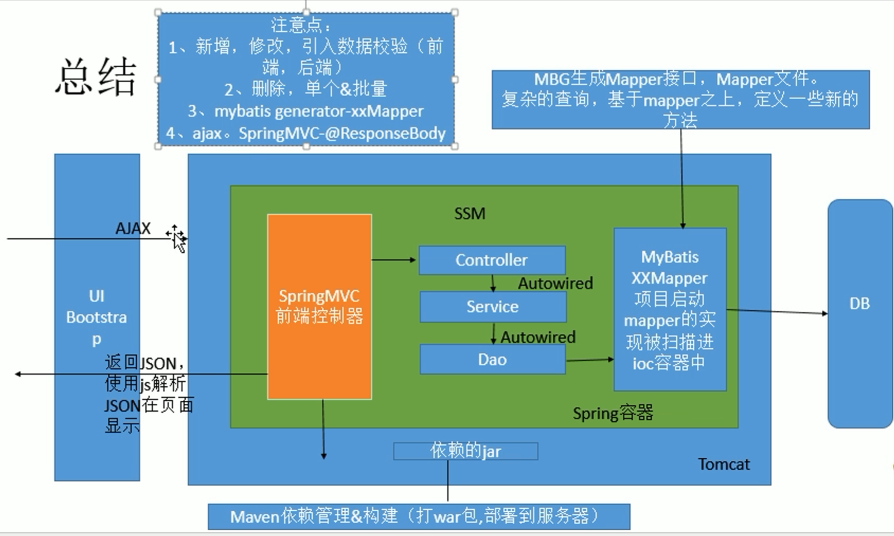

# SSM-CRUD

整合SSM框架实现基本增删改查功能

功能点：

* 分页
* 数据校验
* ajax
* 使用HTTP协议请求方式，标识对资源的操作
  * GET(查询)
  * POST(新增)
  * PUT(修改)
  * DELETE(删除)）

# 1 环境搭建

* 1.创建Maven工程

  * 正常创建一个maven工程即可，建议选用maven-app，需要自己创建java和resources文件夹

* 2.引入项目依赖包

  * 2.1 pom.xml中需要引入的包
    * spring，spring-mvc，mybatis，数据库连接池，驱动包
    * jstl, servlet-api, junit

* * 2.2 通过properties设置依赖包版本

  ```xml
  <!--通过properties设置spring版本一致可避免一些不必要的错误-->
  <!--指定jdk版本避免出错-->
  <!--引入依赖-->
  <properties>
      <maven.compiler.target>1.8</maven.compiler.target>
      <maven.compiler.source>1.8</maven.compiler.source>
      <junit.version>5.7.0</junit.version>
      <spring.version>5.3.4</spring.version>
  </properties>
  ```

  * 2.3 spring相关依赖

    ```xml
    <!-- 引入Spring MVC模块 -->
    <dependency>
        <groupId>org.springframework</groupId>
        <artifactId>spring-webmvc</artifactId>
        <version>${spring.version}</version>
    </dependency>
    <!-- 引入Spring JDBC模块 -->
    <dependency>
        <groupId>org.springframework</groupId>
        <artifactId>spring-jdbc</artifactId>
        <version>${spring.version}</version>
    </dependency>
    <!-- Spring事务控制 -->
    <dependency>
        <groupId>org.springframework</groupId>
        <artifactId>spring-tx</artifactId>
        <version>${spring.version}</version>
    </dependency>
    <!-- aspectj解析切入点表达式 -->
    <dependency>
        <groupId>org.aspectj</groupId>
        <artifactId>aspectjweaver</artifactId>
        <version>1.9.6</version>
    </dependency>
    <!-- Spring测试模块(整合Junit) -->
    <dependency>
        <groupId>org.springframework</groupId>
        <artifactId>spring-test</artifactId>
        <version>${spring.version}</version>
    </dependency>
    ```

  * 2.4 数据库、数据库连接池级mybatis相关依赖

    * 注：**根据自己数据库版本修改MySQL驱动版本，dependencies和build两处需要修改。**

    ```xml
    <!-- Mybatis Generator代码生成器 -->
    <dependency>
        <groupId>org.mybatis.generator</groupId>
        <artifactId>mybatis-generator-core</artifactId>
        <version>1.4.0</version>
    </dependency>
    <!-- mybatis-spring适配包 -->
    <dependency>
        <groupId>org.mybatis</groupId>
        <artifactId>mybatis-spring</artifactId>
        <version>2.0.6</version>
    </dependency>
    <!-- Mybatis操作数据库 -->
    <dependency>
        <groupId>org.mybatis</groupId>
        <artifactId>mybatis</artifactId>
        <version>3.5.6</version>
    </dependency>
    <!-- MySQL驱动 -->
    <dependency>
        <groupId>mysql</groupId>
        <artifactId>mysql-connector-java</artifactId>
        <version>5.1.47</version>
    </dependency>
    <!-- Druid连接池 -->
    <dependency>
        <groupId>com.alibaba</groupId>
        <artifactId>druid</artifactId>
        <version>1.2.5</version>
    </dependency>
    <!-- mybatis-ehcache适配包 -->
    <dependency>
        <groupId>org.mybatis.caches</groupId>
        <artifactId>mybatis-ehcache</artifactId>
        <version>1.2.1</version>
    </dependency>
    <!-- slf4j-simple (mybatis-ehcache需要这个包) -->
    <dependency>
        <groupId>org.slf4j</groupId>
        <artifactId>slf4j-simple</artifactId>
        <version>1.7.30</version>
    </dependency>
    ```

  * 2.5 jstl, servlet-api, junit相关依赖

    ```xml
    <!-- 引入JSTL, Servlet, Junit等基础依赖 -->
    <dependency>
        <groupId>javax.servlet</groupId>
        <artifactId>jstl</artifactId>
        <version>1.2</version>
    </dependency>
    <dependency>
        <groupId>org.apache.taglibs</groupId>
        <artifactId>taglibs-standard-impl</artifactId>
        <version>1.2.5</version>
    </dependency>
    <dependency>
        <groupId>javax.servlet</groupId>
        <artifactId>javax.servlet-api</artifactId>
        <version>4.0.1</version>
        <scope>provided</scope>
    </dependency>
    <dependency>
        <groupId>org.junit.jupiter</groupId>
        <artifactId>junit-jupiter-api</artifactId>
        <version>${junit.version}</version>
        <scope>test</scope>
    </dependency>
    <dependency>
        <groupId>org.junit.jupiter</groupId>
        <artifactId>junit-jupiter-engine</artifactId>
        <version>${junit.version}</version>
        <scope>test</scope>
    </dependency>
    ```


* 3.引入bootstrap框架

  * 建议直接复制views文件夹到自己的WEB-INF文件夹下（foot.jsp及header.jsp）

* 4.编写ssm整合关键配置文件

  * web.xml

  * ```xml
    <!--此处需要在/WEB-INF/分别创建springmvc.xml及applicationContext.xml文件-->
    <?xml version="1.0" encoding="UTF-8"?>
    <web-app xmlns:xsi="http://www.w3.org/2001/XMLSchema-instance"
             xmlns="http://xmlns.jcp.org/xml/ns/javaee"
             xsi:schemaLocation="http://xmlns.jcp.org/xml/ns/javaee 
             http://xmlns.jcp.org/xml/ns/javaee/web-app_4_0.xsd"
             version="4.0">
        
        <!--1.启动Spring的容器-->
        <!-- 配置ContextLoaderListener, 加载Spring父容器 -->
        <context-param>
            <!-- 指定Spring配置文件位置 -->
            <param-name>contextConfigLocation</param-name>
            <param-value>/WEB-INF/applicationContext.xml</param-value>
        </context-param>
        
        <!--2.Spring MVC的前端控制器，拦截所有请求-->
        <listener>
            <!-- 该监听器将根据contextConfigLocation参数加载Spring配置文件, 初始化Spring应用上下文 -->
            <listener-class>org.springframework.web.context.ContextLoaderListener</listener-class>
        </listener>

        <!--3.配置DispatcherServlet, 加载Spring MVC子容器 -->
        <servlet>
            <servlet-name>springmvc</servlet-name>
            <servlet-class>org.springframework.web.servlet.DispatcherServlet</servlet-class>
            <init-param>
                <!-- 指定Spring MVC配置文件位置, 默认是 /WEB-INF/<servlet-name>-servlet.xml -->
                <param-name>contextConfigLocation</param-name>
                <param-value>/WEB-INF/springmvc.xml</param-value>
            </init-param>
            <!-- 随Tomcat一起启动 -->
            <load-on-startup>1</load-on-startup>
        </servlet>
        <!--4.配置springmvc servlet映射器-->
        <servlet-mapping>
            <servlet-name>springmvc</servlet-name>
            <!-- / 接收所有请求, 除了jsp -->
            <!-- /* 接收所有请求, 包括jsp -->
            <url-pattern>/</url-pattern>
        </servlet-mapping>

        <!-- 5.配置字符编码过滤器, 用于设置请求和响应的编码 -->
        <!-- 该过滤器必须配置在所有过滤器之前!! -->
        <filter>
            <filter-name>CharacterEncodingFilter</filter-name>
            <filter-class>org.springframework.web.filter.CharacterEncodingFilter</filter-class>
            <!--UTF-8编码-->
            <init-param>
                <param-name>encoding</param-name>
                <param-value>UTF-8</param-value>
            </init-param>
            <!-- 强制设置响应编码, 不强制设置请求编码(当请求中未指定编码时才设置) -->
            <init-param>
                <param-name>forceResponseEncoding</param-name>
                <param-value>true</param-value>
            </init-param>
        </filter>
        <filter-mapping>
            <filter-name>CharacterEncodingFilter</filter-name>
            <url-pattern>/*</url-pattern>
        </filter-mapping>

        <!-- 6.配置HTTP方法过滤器, 实现REST风格的增删改查 -->
        <!-- 将页面的post请求转为指定的delete或者put请求-->
        <!-- 该过滤器根据指定的请求参数(默认是"_method")来修改请求的类型 -->
        <filter>
            <filter-name>HiddenHttpMethodFilter</filter-name>
            <filter-class>org.springframework.web.filter.HiddenHttpMethodFilter</filter-class>
        </filter>
        <filter-mapping>
            <filter-name>HiddenHttpMethodFilter</filter-name>
            <url-pattern>/*</url-pattern>
        </filter-mapping>
    </web-app>
    ```


  * spring-mvc的配置，作为 前端控制器，拦截所有请求，负责网站跳转逻辑，配置
    * **注：mvc注解驱动部分需要实现自定义转换器接口，配置指定的ConversionService, 用于请求参数到对象的转换（将ajax请求参数转为对象）。**

  ```xml
<?xml version="1.0" encoding="UTF-8"?>
<beans xmlns:xsi="http://www.w3.org/2001/XMLSchema-instance"
       xmlns:mvc="http://www.springframework.org/schema/mvc"
       xmlns:context="http://www.springframework.org/schema/context"
       xmlns="http://www.springframework.org/schema/beans"
       xsi:schemaLocation="http://www.springframework.org/schema/beans
                           http://www.springframework.org/schema/beans/spring-beans.xsd
                           http://www.springframework.org/schema/mvc
                           https://www.springframework.org/schema/mvc/spring-mvc.xsd
                           http://www.springframework.org/schema/context
                           https://www.springframework.org/schema/context/spring-context.xsd">

<!--1.配置扫描控制器-->
    <!--只扫描配置的控制器,需要禁用掉过滤器默认规则-->
    <context:component-scan base-package="com.chen.crud" use-default-filters="false">
        <!--1.配置扫描控制器-->
        <context:include-filter type="annotation" expression="org.springframework.stereotype.Controller"/>
        <context:include-filter type="annotation" expression="org.springframework.web.bind.annotation.RestController"/>
        <context:include-filter type="annotation"
                                expression="org.springframework.web.bind.annotation.ControllerAdvice"/>
    </context:component-scan>

    <!--2.配置试图解析器-->
    <bean class="org.springframework.web.servlet.view.InternalResourceViewResolver">
        <!--2.1配置视图解析器路径  prefix路径前缀,suffix路径后缀-->
        <property name="prefix" value="/WEB-INF/views/"/>
        <property name="suffix" value=".jsp"/>
    </bean>

    <!--3.添加两个标准配置-->
    <!--Spring MVC不能处理的请求交由tomcat-->
    <mvc:default-servlet-handler/>
    <!--MVC注解驱动,支持一些 Spring MVC更高级的功能,支持基于注解的JSR303校验, 处理Ajax请求, 映射动态请求等-->
    <mvc:annotation-driven validator="validator" conversion-service="conversionService"/>


    <!-- 4.配置校验器 -->
    <bean id="validator" class="org.springframework.validation.beanvalidation.LocalValidatorFactoryBean">
        <!-- 使用hibernate校验器 -->
        <property name="providerClass" value="org.hibernate.validator.HibernateValidator"/>
    </bean>

    <!--
    ajax提交表单，使用conversionService将客户端提交的字符串转换为Integer，controller回传对象，页面显示信息
    需要在annotation-driven中引用转换器
    -->
    <!--5.配置指定的ConversionService, 用于类型转换和数据格式化-->
    <bean id="conversionService" class="org.springframework.format.support.FormattingConversionServiceFactoryBean">
        <!--注册自定义的类型转换器-->
        <property name="converters">
            <set>
                <bean class="com.chen.crud.converter.StringToIntegerListConverter"/>
            </set>
        </property>
    </bean>
</beans>
  ```

  * spring 启动Spring的容器， applicationContext.xml的配置


  ```xml
<?xml version="1.0" encoding="UTF-8"?>
<beans xmlns="http://www.springframework.org/schema/beans"
       xmlns:xsi="http://www.w3.org/2001/XMLSchema-instance"
       xmlns:context="http://www.springframework.org/schema/context"
       xmlns:aop="http://www.springframework.org/schema/aop"
       xmlns:tx="http://www.springframework.org/schema/tx"
       xsi:schemaLocation="http://www.springframework.org/schema/beans
                           http://www.springframework.org/schema/beans/spring-beans.xsd
                           http://www.springframework.org/schema/context
                           http://www.springframework.org/schema/context/spring-context.xsd
                           http://www.springframework.org/schema/aop
                           https://www.springframework.org/schema/aop/spring-aop.xsd
                           http://www.springframework.org/schema/tx
                           http://www.springframework.org/schema/tx/spring-tx.xsd">

    <!--1.配置Spring包扫描器, Spring负责管理数据源/事务控制/AOP/业务逻辑等操作-->
    <!-- 扫描除了Controller和ControllerAdvice外的所有注解 -->
    <context:component-scan base-package="com.chen.crud">
        <context:exclude-filter type="annotation" expression="org.springframework.stereotype.Controller"/>
        <context:exclude-filter type="annotation"
                                expression="org.springframework.web.bind.annotation.ControllerAdvice"/>
    </context:component-scan>


    <!--2.配置数据源-->
    <!--2.1引入jdbc文件-->
    <context:property-placeholder location="classpath:dbconfig.properties" file-encoding="UTF-8"/>
    <!--2.2配置数据源(Druid连接池) -->
    <bean id="dataSource" class="com.alibaba.druid.pool.DruidDataSource">
        <property name="url" value="${jdbc.url}"/>
        <property name="username" value="${jdbc.username}"/>
        <property name="password" value="${jdbc.password}"/>
        <property name="filters" value="${jdbc.filters}"/>
        <property name="initialSize" value="${jdbc.initialSize}"/>
        <property name="maxActive" value="${jdbc.maxActive}"/>
        <property name="minIdle" value="${jdbc.minIdle}"/>
        <property name="timeBetweenEvictionRunsMillis" value="${jdbc.timeBetweenEvictionRunsMillis}"/>
        <property name="minEvictableIdleTimeMillis" value="${jdbc.minEvictableIdleTimeMillis}"/>
        <property name="validationQuery" value="${jdbc.validationQuery}"/>
        <property name="testWhileIdle" value="${jdbc.testWhileIdle}"/>
        <property name="testOnBorrow" value="${jdbc.testOnBorrow}"/>
        <property name="testOnReturn" value="${jdbc.testOnReturn}"/>
        <property name="poolPreparedStatements" value="${jdbc.poolPreparedStatements}"/>
        <property name="maxPoolPreparedStatementPerConnectionSize"
                  value="${jdbc.maxPoolPreparedStatementPerConnectionSize}"/>
    </bean>

    <!--3.Spring-Mybatis整合配置-->
    <!-- SqlSessionFactoryBean, 用于创建SqlSessionFactory -->
    <bean id="sqlSessionFactory" class="org.mybatis.spring.SqlSessionFactoryBean">
        <!-- 设置数据源 -->
        <property name="dataSource" ref="dataSource"/>
        <!-- 指定Mybatis配置文件位置 -->
        <property name="configLocation" value="classpath:mybatis-config.xml"/>
        <!-- 以下设置既可以写在Mybatis配置文件中, 也可以在这里显式给出 -->
        <!-- 指定SQL映射文件位置 -->
        <property name="mapperLocations" value="classpath:mapper/**/*.xml"/>
        <!-- 配置Mybatis插件 -->
        <property name="plugins">
            <array>
                <bean class="com.github.pagehelper.PageInterceptor">
                    <property name="properties">
                        <props>
                            <!-- 使用下面的方式配置参数, 一行配置一个 -->
                            <prop key="reasonable">true</prop>
                        </props>
                    </property>
                </bean>
            </array>
        </property>
    </bean>

    <!-- MapperScannerConfigurer, 扫描指定包下的mapper接口, 创建实例并添加到Spring IOC容器中 -->
    <bean class="org.mybatis.spring.mapper.MapperScannerConfigurer">
        <!-- 指定mapper接口所在的包 -->
        <property name="basePackage" value="com.chen.crud.dao"/>
        <!-- (可选)只扫描带了Resource注解的mapper接口(适用于拓展MBG生成的mapper接口) -->
        <property name="annotationClass" value="javax.annotation.Resource"/>
        <!-- (可选)配置了多个SqlSessionFactory时需要指定使用哪一个 -->
        <property name="sqlSessionFactoryBeanName" value="sqlSessionFactory"/>
    </bean>

    <!--配置用于批量操作的SqlSessionTemplate,线程安全,不需要手动关闭-->
    <bean id="sqlSession" class="org.mybatis.spring.SqlSessionTemplate">
        <constructor-arg name="sqlSessionFactory" ref="sqlSessionFactory"/>
        <constructor-arg name="executorType" value="BATCH"/>
    </bean>


    <!--4.事务管理的配置-->
    <!-- 配置事务管理器 -->
    <bean id="transactionManager" class="org.springframework.jdbc.datasource.DataSourceTransactionManager">
        <!-- 设置数据源 -->
        <property name="dataSource" ref="dataSource"/>
    </bean>
    <!-- 开启事务管理的注解驱动, 扫描@Transactional等注解 -->
    <!--<tx:annotation-driven/>-->

    <!-- 结合AOP实现事务的植入,配置事务增强 -->
    <tx:advice id="txAdvice" transaction-manager="transactionManager">
        <!-- 配置事务属性 -->
        <tx:attributes>
            <!-- name属性指定要在哪些方法上开启事务, 相当于对切入点进行二次过滤 -->
            <tx:method name="get*" read-only="true" propagation="SUPPORTS"/>
            <tx:method name="query*" read-only="true" propagation="SUPPORTS"/>
            <tx:method name="*" read-only="false" propagation="REQUIRED" rollback-for="java.lang.Exception"/>
        </tx:attributes>
    </tx:advice>

    <!-- AOP配置,配置事务的切入 -->
    <aop:config>
        <!-- 配置切入点表达式 -->
        <aop:pointcut id="servicePt" expression="execution(* com.chen.crud.service..*.*(..))"/>
        <!-- 配置切面, 将Pointcut和Advice关联起来 -->
        <aop:advisor advice-ref="txAdvice" pointcut-ref="servicePt"/>
    </aop:config>

</beans>

  ```

  * dbconfig.properties配置

  ```properties
参照properties即可,工程中使用的是durid连接池,需要更改本地sql的账号密码.
  ```

  * mybatis-config.xml

  ```xml
参照mybatis-config.xml即可,typeAlias类型别名及开启驼峰命名转换为必选项.
  ```

  * mybatis逆向工程生成对应的bean及mapper


```xml
本部分使用mbg.xml和test文件下的Generator.java文件即可,生成对应的bean,mapper,entity
```

**注:若自己创建表,可使用测试EmployeeMapperExtTest.java中的**** **batchInsert方法插入大量数据**

# 2 环境测试

目的：测试mybatis生成的mapper是否能正常连通数据库(测试dao层).

主要根据test文件下的java测试用例进行测试即可.

# 3 查询

* 基本流程：

1.index发送ajax请求进行员工分页数据查询

2.服务器将查出的数据,一json字符串形式返回给浏览器

3.浏览器收到js字符串,使用js对json进行解析,使用js通过dom增删改查改变页面

4.返回json,实现客户端无关性

**总结:前端通过ajax发送请求--后台通过SpringMVC响应---返回前端JSON数据**

此处对前后端交互还是不太理解的可参考博客:

https://blog.csdn.net/qq_42585466/article/details/104131835

# 4 增加\删除\更新

基本逻辑相差不大.

# 5 总结

对本部分还不太了解前往尚硅谷视频跟着学习:

https://www.bilibili.com/video/BV17W411g7zP?p=1

视频中老师用的eclipse,本项目使用IDEA.

视频中依赖包,spring版本可参考此项目.




